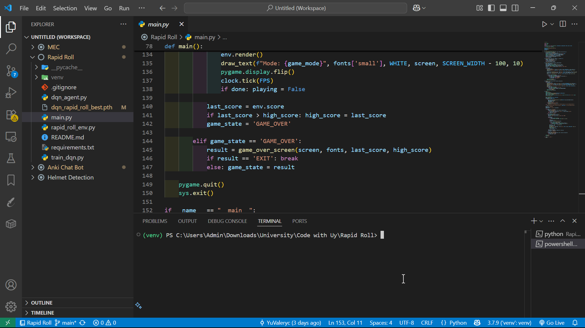

# Rapid Roll AI

Rapid Roll AI là một game được phát triển bằng Pygame, trong đó người chơi điều khiển một quả bóng di chuyển qua các nền tảng. Dự án này cũng tích hợp một AI agent sử dụng thuật toán Deep Q-Network (DQN) để tự động chơi game.

## 💡 Demo



## Tính năng

- **Chế độ chơi thủ công:** Người chơi có thể điều khiển quả bóng bằng các phím mũi tên -> hoặc <-.
- **Chế độ AI:** Sử dụng mô hình DQN đã được huấn luyện để tự động chơi game.
- **Giao diện người dùng:** Menu chính, màn hình game over, và hiển thị điểm số.
- **Tốc độ tăng dần:** Tốc độ cuộn của game tăng dần theo thời gian, tạo thách thức cho người chơi.

## Cấu trúc dự án

- **`main.py`:** File chính chứa vòng lặp game, xử lý sự kiện, và giao diện người dùng.
- **`rapid_roll_env.py`:** Môi trường game, định nghĩa các đối tượng như quả bóng, nền tảng, và logic game.
- **`dqn_agent.py`:** Định nghĩa lớp DQNAgent, bao gồm mạng neural, bộ nhớ replay, và các phương thức học.
- **`train_dqn.py`:** Script huấn luyện mô hình DQN, lưu model tốt nhất và model cuối cùng.
- **`requirements.txt`:** Danh sách các thư viện cần thiết để chạy dự án.

## Cài đặt

1. **Clone repository:**
   ```bash
   git clone <repository-url>
   cd Rapid-Roll
   ```

2. **Tạo và kích hoạt môi trường ảo:**
   ```bash
   python -m venv .venv
   .venv/bin/activate  # Linux/macOS
   .venv\Scripts\activate  # Windows
   ```

3. **Cài đặt các thư viện:**
   ```bash
   pip install -r requirements.txt
   ```

## Chạy game

- **Huấn luyện mô hình DQN:**
  ```bash
  python train_dqn.py
  ```

- **Chạy game với chế độ thủ công:**
  ```bash
  python main.py
  ```
